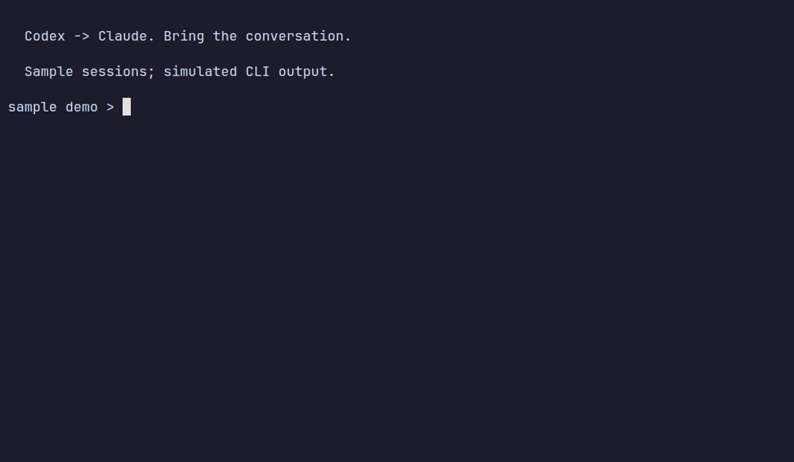

<h1 align="center">showagent</h1>

<p align="center"><b>showagent</b> — every AI coding session on your machine, in one TUI.<br>
Browse, search, resume, branch — and <em>convert</em> a conversation from one agent to another.<br>
Codex · Claude Code · Gemini CLI · OpenCode · jcode</p>

<p align="center">
<a href="https://github.com/aytzey/showagent/actions/workflows/ci.yml"></a>
<a href="https://github.com/aytzey/showagent/releases/latest"></a>
<a href="LICENSE"></a>
</p>



> Started debugging in Codex and want Claude's take? Press `x`. The whole
> conversation moves with you.

## Why

You use more than one coding agent now — most of us do. But every agent buries
its sessions in its own format under its own dot-directory, and yesterday's
context is trapped in whichever tool you happened to start it in. showagent
reads the session stores straight off disk and gives you one searchable picker
for all of them. It is the only TUI that combines browse + search + resume +
branch + convert across agents.

- **One list for everything** — sessions from every agent, grouped by
  workspace, fuzzy-searchable, newest first.
- **Resume or branch anywhere** — reopen a session in its own CLI, or fork a
  local copy to try a different direction.
- **Convert between agents** — rewrite a session into another agent's native
  format so that agent's own resume just works. Originals are never modified;
  conversions are written atomically.
- **100% local** — one static binary that reads your own files. No server, no
  telemetry, no account.

## Supported agents

| Agent | CLI | Sessions read from | Env override | Convert from | Convert to |
|---|---|---|---|:---:|:---:|
| Codex | `codex` | `~/.codex/sessions/**/*.jsonl` | `CODEX_HOME` | ✅ | ✅ |
| Claude Code | `claude` | `~/.claude/projects/**/*.jsonl` | `CLAUDE_HOME` | ✅ | ✅ |
| Gemini CLI | `gemini` | `~/.gemini/tmp/<project>/chats/` | `GEMINI_CLI_HOME` | ✅ | ✅ |
| OpenCode | `opencode` | `opencode.db`, via the `opencode` CLI | `OPENCODE_DATA_HOME` | ✅ | ✅ |
| jcode | `jcode` | `~/.jcode/sessions/*.json` | `JCODE_HOME` | ✅ | ✅ |

Notes:

- OpenCode stores sessions in a SQLite database, so every OpenCode operation
  (discover, export, import, delete) goes through your own `opencode` CLI —
  showagent never writes into the database directly. OpenCode and jcode only
  appear when their CLI is installed.
- Converting *to* an agent requires that agent's CLI on `PATH`, so the result
  can actually be resumed.
- Platforms: Linux and macOS (amd64 + arm64). Windows (amd64) builds are
  released but **experimental**: resume runs the agent as a child process
  instead of replacing showagent.

## Install

```sh
# Homebrew (available after v0.7.0)
brew install aytzey/tap/showagent

# install script (Linux/macOS, puts the binary in ~/.local/bin)
curl -fsSL https://raw.githubusercontent.com/aytzey/showagent/main/scripts/install.sh | sh

# Go 1.25+
go install github.com/aytzey/showagent/cmd/showagent@latest
```

Or grab an archive from the [releases page](https://github.com/aytzey/showagent/releases/latest)
— `linux`/`darwin` amd64 + arm64, `windows` amd64 (experimental).

## Quick start

```sh
showagent                  # open the interactive picker
showagent list             # plain table of every session
showagent list --json      # the same, machine-readable
showagent resume latest    # reopen the most recent session, any agent
showagent --help           # full CLI help
```

### Keybindings

| Key | Action |
|---|---|
| `↑/k`, `↓/j`, `pgup/pgdn` | Move through sessions |
| `/` | Fuzzy search across agent, workspace, session id, and messages |
| `enter` | Resume the selected session in its own CLI |
| `1`..`9` | Toggle provider visibility, numbered as listed in the header bar |
| `p` | Cycle the preview column: first → latest → first + latest message |
| `space` | Collapse or expand the selected workspace group |
| `o` | Cycle the convert target for the selected session |
| `t` | Cycle the convert scope: all turns, or latest 200/100/50/20/10 |
| `x` | Convert to the target agent and select the new session |
| `n` | Branch: create a full local copy of the session |
| `y` | Toggle yolo resume (skip the agent's permission prompts) |
| `C` | Compound: resume with a learnings-capture prompt (see below) |
| `d`, `del`, `backspace` | Delete the session — second press confirms, moving disarms |
| `r` | Rescan session stores (keeps cursor, search, and filters) |
| `?` | Toggle the full keybinding overlay |
| `esc` | Clear search / close overlay / cancel an armed delete (never quits) |
| `q`, `ctrl+c` | Quit |

## Scripting

`showagent list --json` emits an array sorted newest-first — the field names
are a stable contract:

```json
[
  {
    "id": "1f7c9a2e-4b31-4c8e-9d02-8a5e3f6b1c44",
    "provider": "codex",
    "workspace": "/home/you/code/api-server",
    "updated": "2026-07-08T19:51:25Z",
    "first_message": "Add rate limiting to POST /v1/charges",
    "last_message": "the redis TTL test is flaky - mock the clock"
  }
]
```

`showagent resume <id|latest> [--yolo]` resumes without the picker, so a shell
alias can reopen your last session in one keystroke. Exit codes: `0` success,
`1` error (including "no sessions found"), `2` usage. When stdout is not a
terminal, plain `showagent` prints the `list` table, so pipes just work.

## How it compares

Great tools exist for *running* agents in parallel — showagent is about the
sessions they leave behind. [claude-squad](https://github.com/smtg-ai/claude-squad)
and [ccmanager](https://github.com/kbwo/ccmanager) orchestrate multiple live
agents in tmux sessions and git worktrees, which is the right choice when you
want several agents working at once.
[Agent Sessions](https://github.com/jazzyalex/agent-sessions) is a polished
macOS app for browsing session history across many agents. showagent is the
history-first, terminal-first take: a single cross-platform binary that reads
the session stores on disk, resumes and branches from them — and is the only
one of the group that converts a session from one agent's format to another's.

## Compound engineering

Press `C` on a session and pick an agent. showagent resumes the session there
and starts it on a compound-engineering pass: review what was solved, then
record the durable learnings as markdown.

Learnings are pooled per project but shared across agents: each workspace gets
a directory under `~/.showagent/learnings/<project>/` (override with
`SHOWAGENT_LEARNINGS_DIR`) that every agent reads and writes. Picking an agent
that did not create the session converts it first, so it has full context.

`showagent setup` installs the companion
[compound-engineering plugin](https://github.com/EveryInc/compound-engineering-plugin)
into the Codex and Claude Code CLIs found on the machine. It is idempotent and
only installs what is missing.

## FAQ

**Is my session data sent anywhere?**
No. showagent is fully local: it reads session files where the agents left
them and makes no network calls. There is no server, no telemetry, and no
account. Message previews additionally redact password-like strings and
API keys before rendering.

**How does conversion work?**
Conversion extracts the user and assistant turns from the source transcript
and writes a brand-new session in the target agent's native format (for
OpenCode, via `opencode import`), so the target's own resume command picks it
up. The original session is never modified, and files are written atomically —
a crash cannot leave a half-written session in another tool's store. It
intentionally does **not** copy tool-call internals, approval history,
encrypted reasoning blobs, or provider attachments: those are private to the
source agent and would not replay correctly anyway. `t` trims the scope to the
latest N turns before converting.

**What does delete actually do?**
Codex sessions are deleted through `codex delete --force`; OpenCode through
`opencode session delete` (which cascades inside its database); Claude Code,
Gemini, and jcode by removing the session file. Delete always takes two
presses, and moving the cursor disarms it.

**Windows?**
Binaries are released and the whole TUI works, but resume semantics are
approximated (child process instead of exec), so Windows is labeled
experimental until it has seen real use.

**A session is missing from the list.**
Run `showagent list` with no sessions found and it prints exactly which
directories were scanned and which env vars override them. `r` rescans
in-place after you start a new conversation.

## Adding a provider

A provider is one self-contained file implementing the 8-method interface in
[`internal/session/provider.go`](internal/session/provider.go) — around 250
lines including discovery, resume arguments, transcript extraction, and
conversion. [`gemini.go`](internal/session/gemini.go) (file-based store) and
[`opencode.go`](internal/session/opencode.go) (CLI-based store) are the two
templates. Register it in the `registry` slice and the TUI picks up badges,
filter keys, and convert targets automatically. Add a matching env override
so its tests stay hermetic. Issues and PRs welcome.

## Building

```sh
git clone https://github.com/aytzey/showagent.git
cd showagent
go test ./...
go build -o showagent ./cmd/showagent
```

The demo GIF is recorded hermetically with [vhs](https://github.com/charmbracelet/vhs)
against fabricated fixtures — see [`demo/README.md`](demo/README.md).

## License

MIT. Built with [Bubble Tea](https://github.com/charmbracelet/bubbletea),
[Bubbles](https://github.com/charmbracelet/bubbles), and
[Lip Gloss](https://github.com/charmbracelet/lipgloss).
